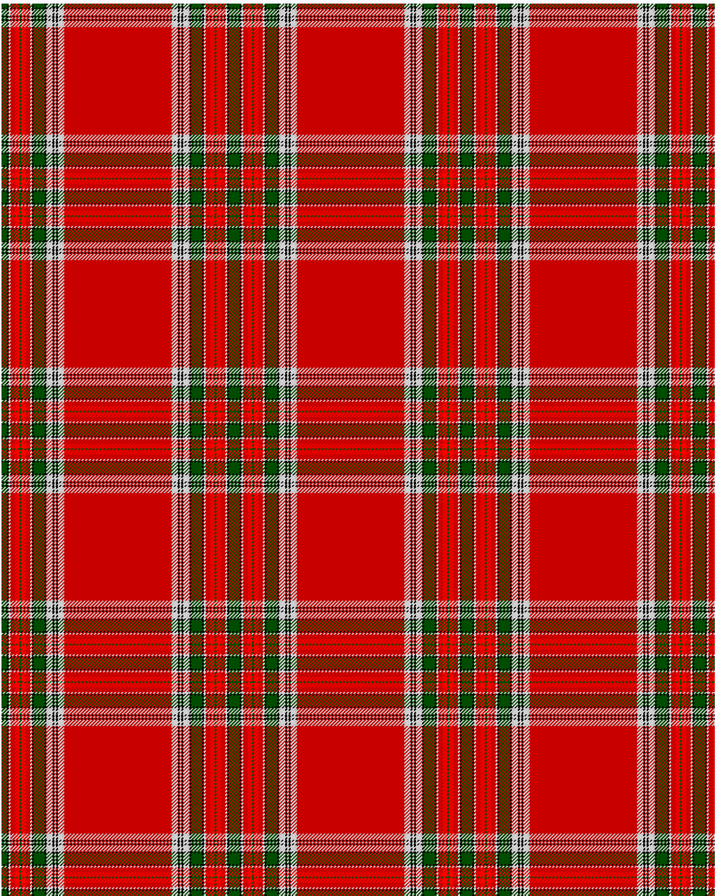

MacBain

This was sourced from <no value>.  It is a 20 stripes tartan.

Original link http://www.weddslist.com/cgi-bin/tartans/pg.pl?source=rb

## Thread count
G/6 K2 N2 R5 RA5 G2 RA5 R5 N2 K2 G12 K2 NA2 N5 K2 NA2 K2 N5 NA2 R/60

## Palette
G#004C00 K#000000 N#D0D0D0 NA#C0C0C0 R#C80000 RA#FF0000

# Sample pattern

ID: G/6/K2/N2/R5/RA5/G2/RA5/R5/N2/K2/G12/K2/NA2/N5/K2/NA2/K2/N5/NA2/R/60-G$004C00 K$000000 N$D0D0D0 NA$C0C0C0 R$C80000 RA$FF0000