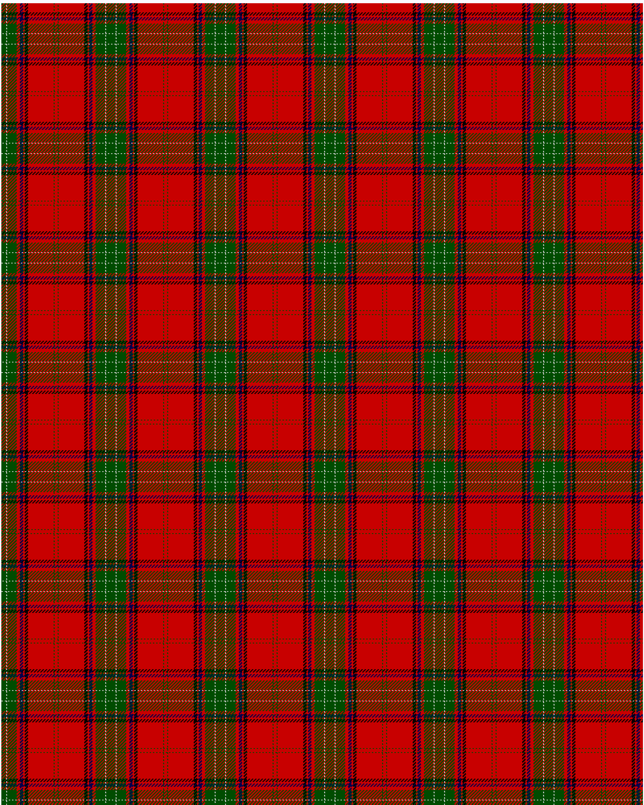

Seton

This was sourced from <no value>.  It is a 10 stripes tartan.

Original link http://www.weddslist.com/cgi-bin/tartans/pg.pl?source=rb

## Thread count
G/6 N1 G12 R4 DB4 R2 K4 R32 G1 R/2

## Palette
DB#00004C G#004C00 K#000000 N#D0D0D0 R#C80000

# Sample pattern

ID: G/6/N1/G12/R4/DB4/R2/K4/R32/G1/R/2-DB$00004C G$004C00 K$000000 N$D0D0D0 R$C80000