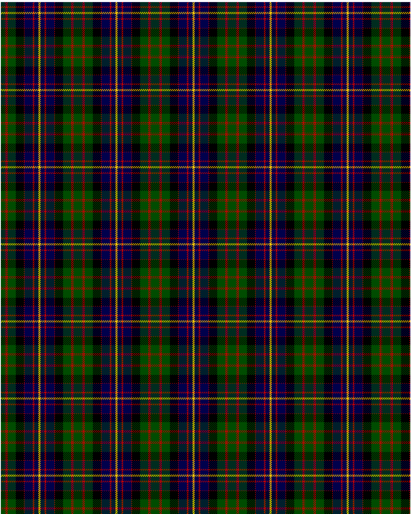

Cameron of Erracht

This was sourced from <no value>.  It is a 11 stripes tartan.

Original link http://www.weddslist.com/cgi-bin/tartans/pg.pl?source=rb

## Thread count
G/8 R1 G1 R3 G16 K16 R1 DB16 R3 DB8 Y/2

## Palette
DB#00004C G#004C00 K#000000 R#C80000 Y#FFC800

# Sample pattern

ID: G/8/R1/G1/R3/G16/K16/R1/DB16/R3/DB8/Y/2-DB$00004C G$004C00 K$000000 R$C80000 Y$FFC800