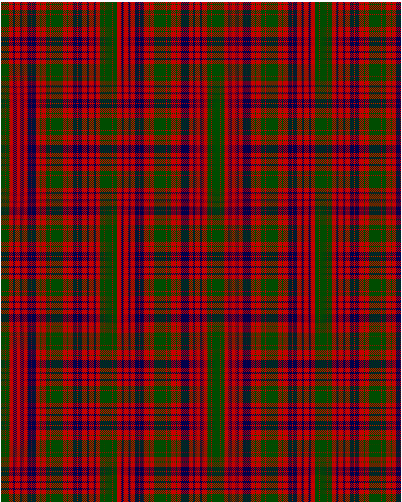

Ross

This was sourced from <no value>.  It is a 27 stripes tartan.

Original link http://www.weddslist.com/cgi-bin/tartans/pg.pl?source=rb

## Thread count
G/8 R1 G8 R8 DB1 R1 DB2 R1 DB1 R8 DB1 R1 DB2 R1 DB1 R8 DB8 R1 DB8 R8 G1 R2 G1 R8 G8 R1 G/8

## Palette
DB#00004C G#004C00 R#C80000

# Sample pattern

ID: G/8/R1/G8/R8/DB1/R1/DB2/R1/DB1/R8/DB1/R1/DB2/R1/DB1/R8/DB8/R1/DB8/R8/G1/R2/G1/R8/G8/R1/G/8-DB$00004C G$004C00 R$C80000