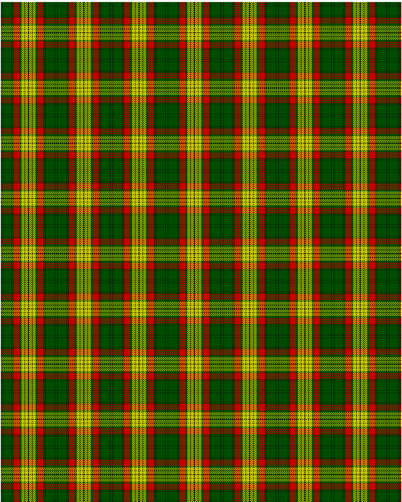

MacMillan Ancient

This was sourced from <no value>.  It is a 12 stripes tartan.

Original link http://www.weddslist.com/cgi-bin/tartans/pg.pl?source=rb

## Thread count
G2 K1 G18 K1 G2 K1 R12 G4 Y6 K1 Y6 K1

## Palette
G#004C00 K#000000 R#C80000 Y#C8C800

# Sample pattern

ID: G2/K1/G18/K1/G2/K1/R12/G4/Y6/K1/Y6/K1-G$004C00 K$000000 R$C80000 Y$C8C800