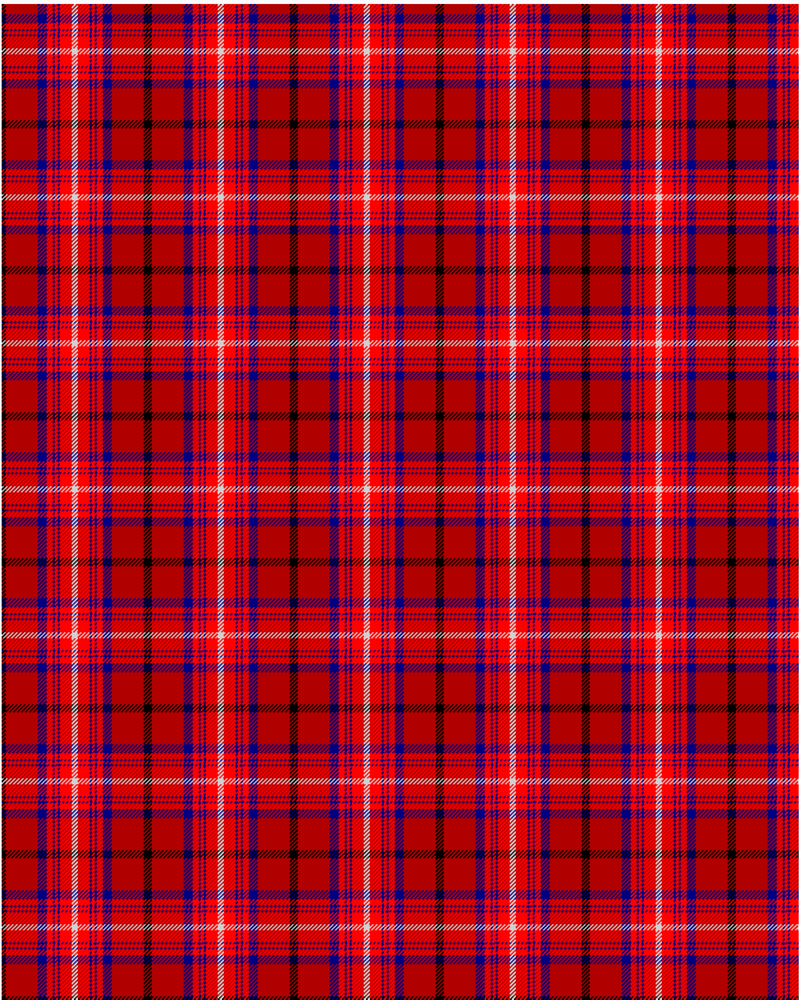

Rose VS

This was sourced from <no value>.  It is a 9 stripes tartan.

Original link http://www.weddslist.com/cgi-bin/tartans/pg.pl?source=rb

## Thread count
K/4 DR32 DB9 R6 DB2 R3 DB2 R12 N/3

## Palette
DB#000080 DR#B00000 K#000000 N#D0D0D0 R#FF0000

# Sample pattern

ID: K/4/DR32/DB9/R6/DB2/R3/DB2/R12/N/3-DB$000080 DR$B00000 K$000000 N$D0D0D0 R$FF0000