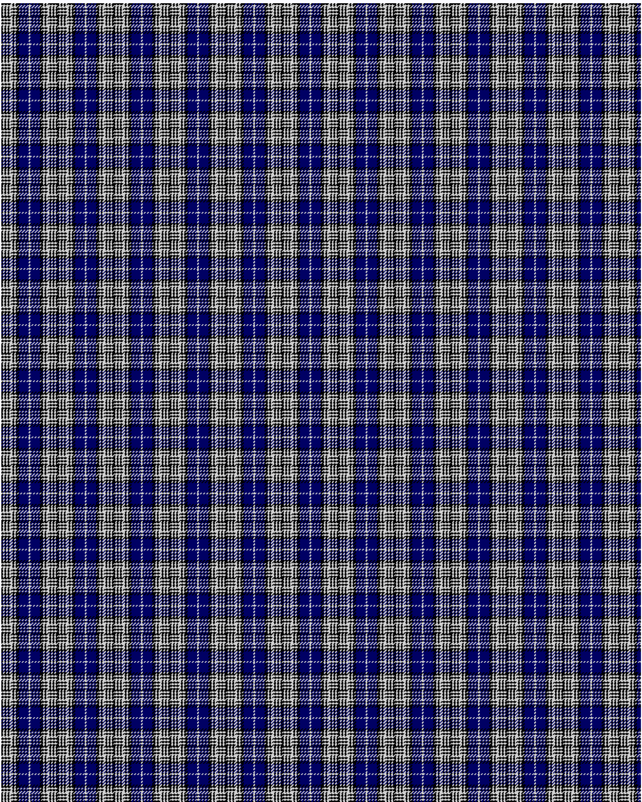

Napier

This was sourced from <no value>.  It is a 11 stripes tartan.

Original link http://www.weddslist.com/cgi-bin/tartans/pg.pl?source=rb

## Thread count
K2 N2 K2 N2 K2 N4 K2 N2 K4 DB12 N1

## Palette
DB#000064 K#000000 N#D0D0D0

# Sample pattern

ID: K2/N2/K2/N2/K2/N4/K2/N2/K4/DB12/N1-DB$000064 K$000000 N$D0D0D0