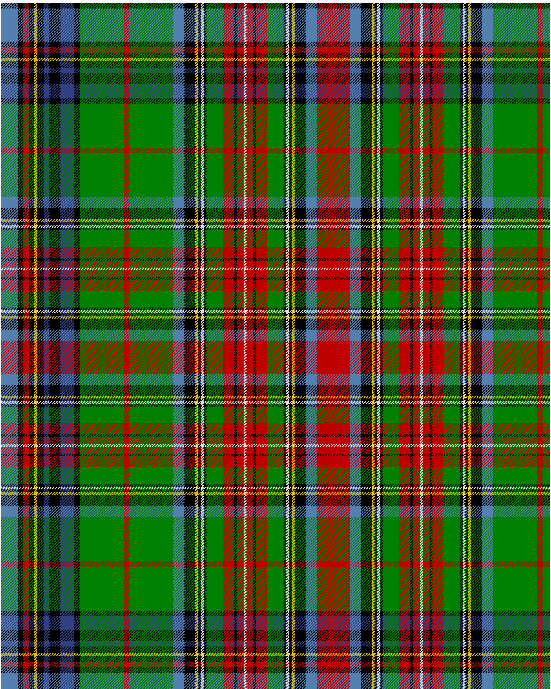

Duchess of Edinburgh

This was sourced from <no value>.  It is a 35 stripes tartan.

Original link http://www.weddslist.com/cgi-bin/tartans/pg.pl?source=sts

## Thread count
LB/24 K8 R8 K8 Y4 K10 B8 K16 B20 K8 G64 R8 G64 LB16 K16 Y4 K4 W4 K4 G24 R16 K4 R10 W4 R10 K4 R16 G24 K4 W4 K4 Y4 K16 LB16 R/24

## Palette
B#304080 G#008000 K#000000 LB#5480B0 R#C00000 W#E0E0E0 Y#F0C000

# Sample pattern

ID: LB/24/K8/R8/K8/Y4/K10/B8/K16/B20/K8/G64/R8/G64/LB16/K16/Y4/K4/W4/K4/G24/R16/K4/R10/W4/R10/K4/R16/G24/K4/W4/K4/Y4/K16/LB16/R/24-B$304080 G$008000 K$000000 LB$5480B0 R$C00000 W$E0E0E0 Y$F0C000