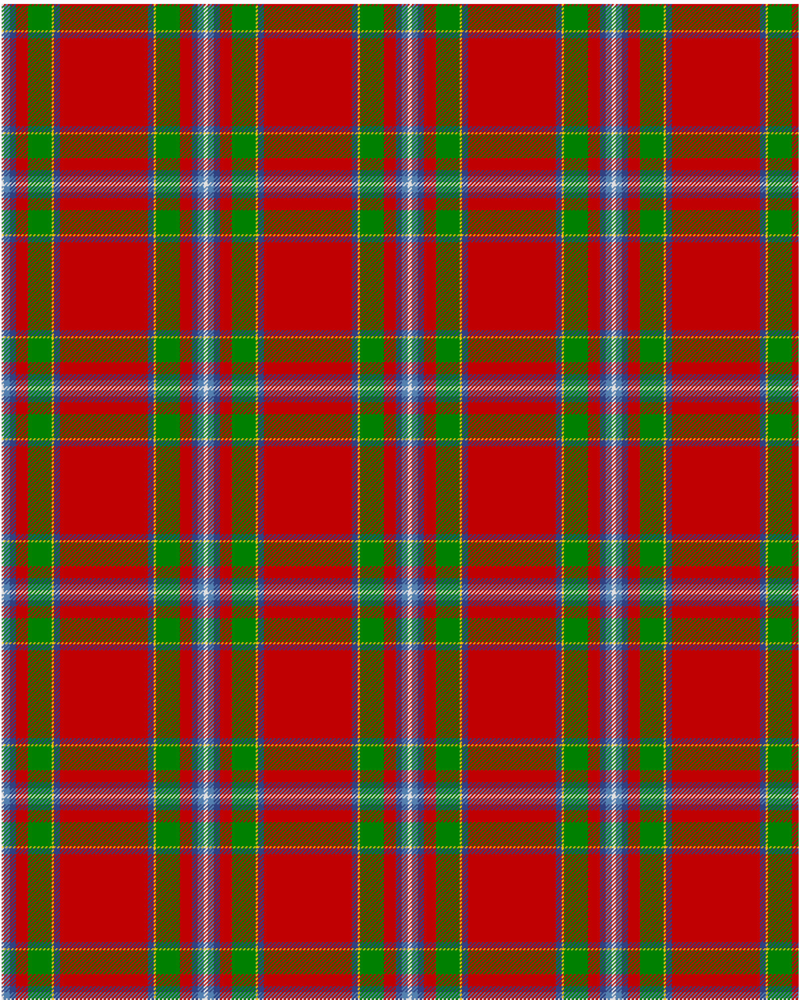

Drummond, (Fingask)

This was sourced from <no value>.  It is a 8 stripes tartan.

Original link http://www.weddslist.com/cgi-bin/tartans/pg.pl?source=sts

## Thread count
LN/2 BA6 B6 R12 G24 Y2 B6 R/44

## Palette
B#304080 BA#5480B0 G#008000 LN#E0E0E0 R#C00000 Y#F0C000

# Sample pattern

ID: LN/2/BA6/B6/R12/G24/Y2/B6/R/44-B$304080 BA$5480B0 G$008000 LN$E0E0E0 R$C00000 Y$F0C000