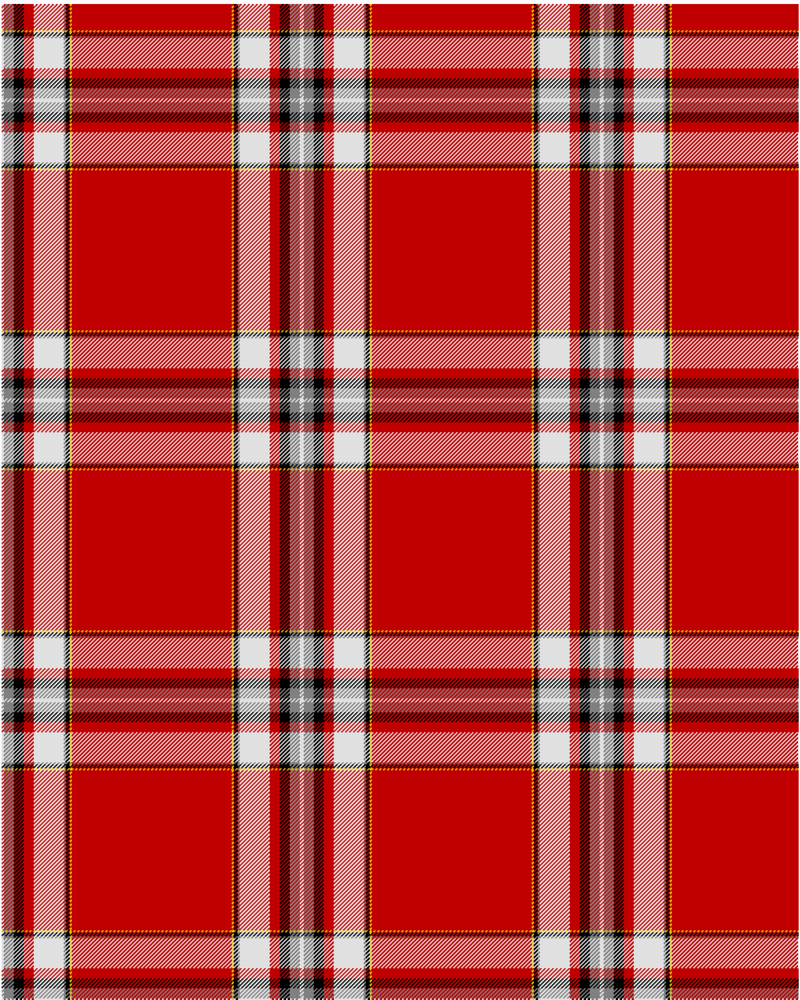

Drummond of Perth, dress

This was sourced from <no value>.  It is a 9 stripes tartan.

Original link http://www.weddslist.com/cgi-bin/tartans/pg.pl?source=sts

## Thread count
LN/2 N10 K10 R10 LN30 N2 K4 Y2 R/80

## Palette
K#000000 LN#E0E0E0 N#808080 R#C00000 Y#F0C000

# Sample pattern

ID: LN/2/N10/K10/R10/LN30/N2/K4/Y2/R/80-K$000000 LN$E0E0E0 N$808080 R$C00000 Y$F0C000