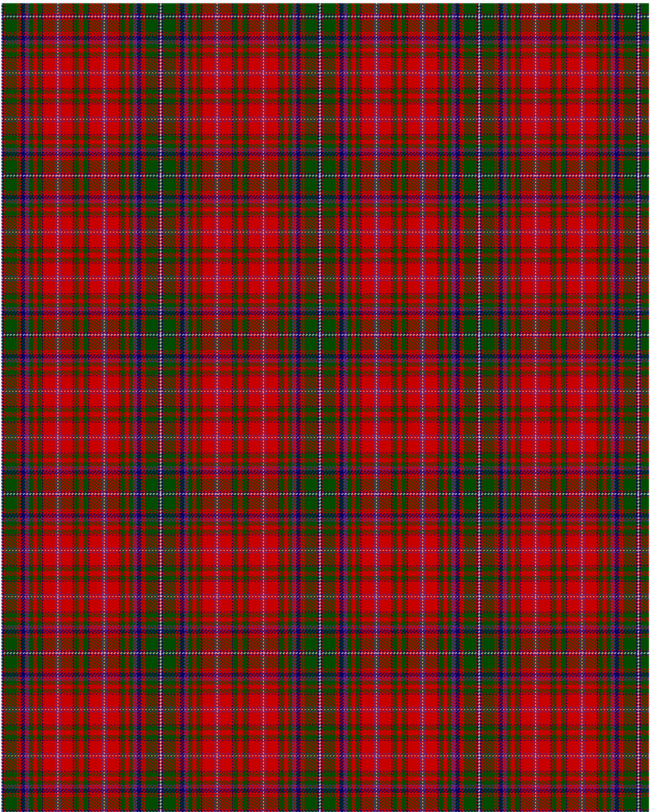

MacDougall D

This was sourced from <no value>.  It is a 27 stripes tartan.

Original link http://www.weddslist.com/cgi-bin/tartans/pg.pl?source=rb

## Thread count
N/1 DB2 R1 G15 R2 G1 R2 DB5 P2 R1 P2 G5 R5 G5 R1 DB1 R15 P2 R1 N1 R1 P2 R15 DB1 R1 G5 R/3

## Palette
DB#000064 G#004C00 N#D0D0D0 P#5A3094 R#C80000

# Sample pattern

ID: N/1/DB2/R1/G15/R2/G1/R2/DB5/P2/R1/P2/G5/R5/G5/R1/DB1/R15/P2/R1/N1/R1/P2/R15/DB1/R1/G5/R/3-DB$000064 G$004C00 N$D0D0D0 P$5A3094 R$C80000