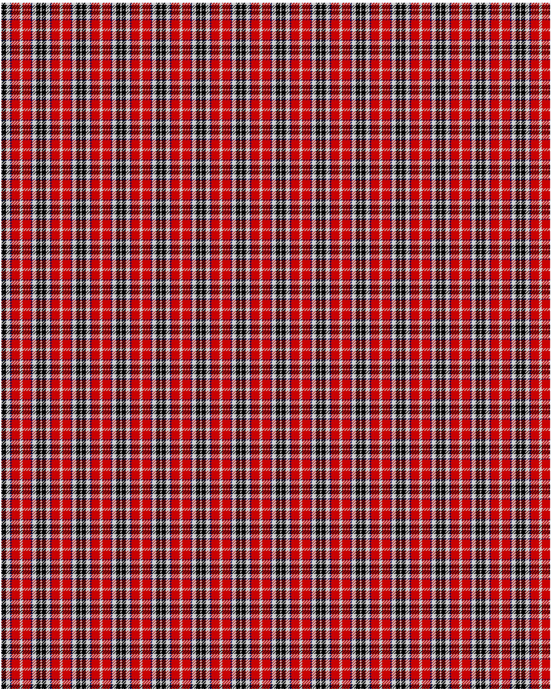

MacTavish

This was sourced from <no value>.  It is a 6 stripes tartan.

Original link http://www.weddslist.com/cgi-bin/tartans/pg.pl?source=rb

## Thread count
N/1 K6 N6 DB2 R12 N/2

## Palette
DB#00004C K#000000 N#D0D0D0 R#C80000

# Sample pattern

ID: N/1/K6/N6/DB2/R12/N/2-DB$00004C K$000000 N$D0D0D0 R$C80000