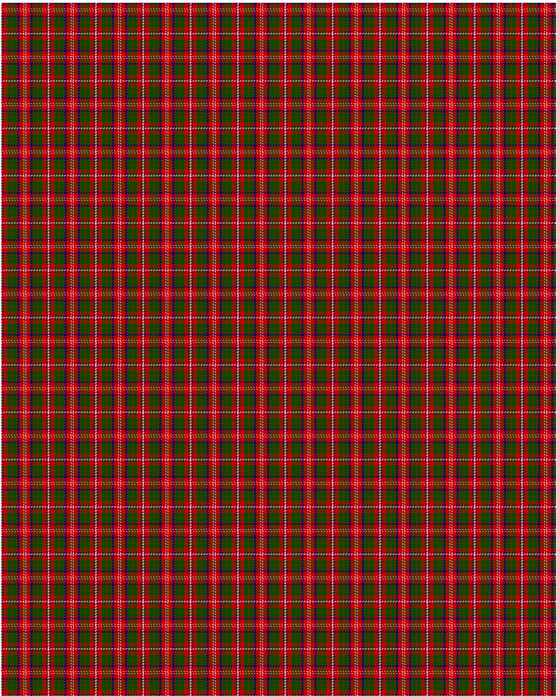

MacQuarrie SM

This was sourced from <no value>.  It is a 12 stripes tartan.

Original link http://www.weddslist.com/cgi-bin/tartans/pg.pl?source=rb

## Thread count
N/1 R1 DB1 R6 G6 R1 G6 R1 DB3 R6 N1 R/1

## Palette
DB#000064 G#004C00 N#D0D0D0 R#C80000

# Sample pattern

ID: N/1/R1/DB1/R6/G6/R1/G6/R1/DB3/R6/N1/R/1-DB$000064 G$004C00 N$D0D0D0 R$C80000