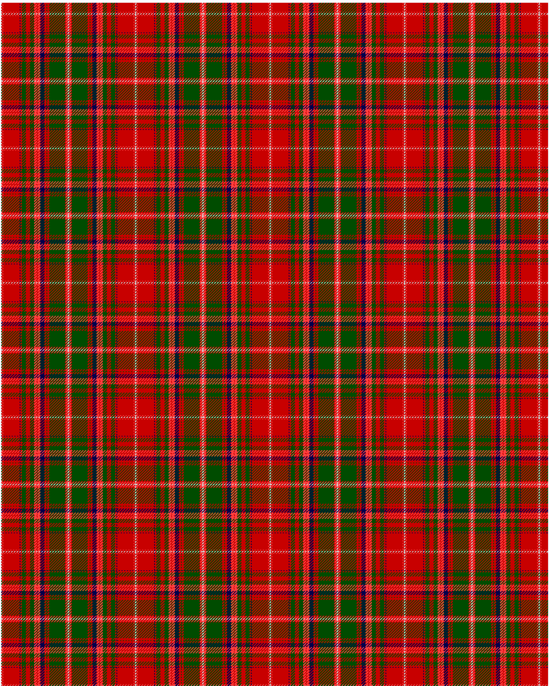

MacDougall

This was sourced from <no value>.  It is a 20 stripes tartan.

Original link http://www.weddslist.com/cgi-bin/tartans/pg.pl?source=rb

## Thread count
N/1 R1 RA1 R24 DB1 R2 G6 R6 G6 RA4 R1 RA4 DB6 R3 G1 R3 G23 R1 RA3 N/1

## Palette
DB#00004C G#004C00 N#D0D0D0 R#C80000 RA#FF4040

# Sample pattern

ID: N/1/R1/RA1/R24/DB1/R2/G6/R6/G6/RA4/R1/RA4/DB6/R3/G1/R3/G23/R1/RA3/N/1-DB$00004C G$004C00 N$D0D0D0 R$C80000 RA$FF4040