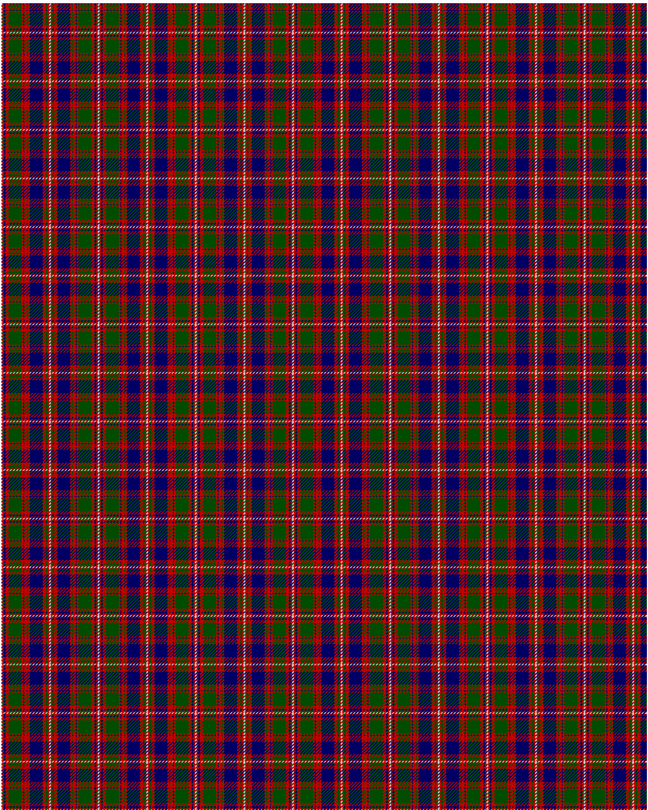

MacIntyre

This was sourced from <no value>.  It is a 15 stripes tartan.

Original link http://www.weddslist.com/cgi-bin/tartans/pg.pl?source=rb

## Thread count
N/1 R2 DB2 R4 G16 R2 DB1 R4 G1 R2 DB16 R4 G2 R2 N/1

## Palette
DB#000064 G#004C00 N#D0D0D0 R#C80000

# Sample pattern

ID: N/1/R2/DB2/R4/G16/R2/DB1/R4/G1/R2/DB16/R4/G2/R2/N/1-DB$000064 G$004C00 N$D0D0D0 R$C80000