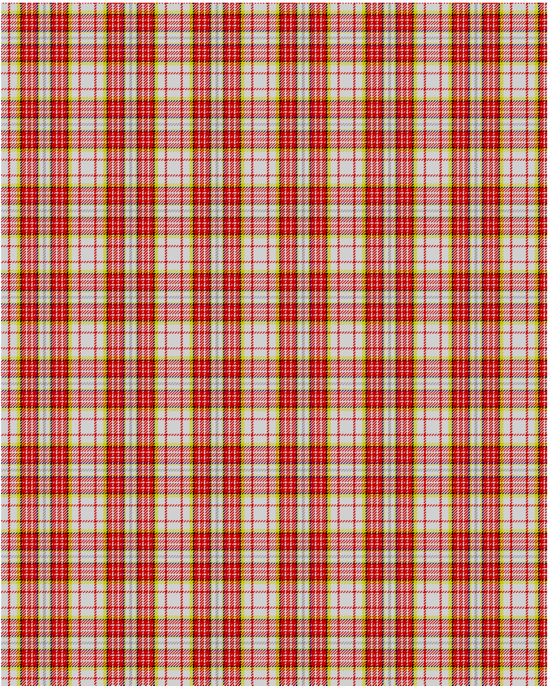

Ogilvy

This was sourced from <no value>.  It is a 14 stripes tartan.

Original link http://www.weddslist.com/cgi-bin/tartans/pg.pl?source=rb

## Thread count
N/10 R3 N10 Y5 K2 R6 N2 R6 N2 R6 DB2 Y2 N5 NA/2

## Palette
DB#000064 K#000000 N#D0D0D0 NA#909090 R#C80000 Y#C8C800

# Sample pattern

ID: N/10/R3/N10/Y5/K2/R6/N2/R6/N2/R6/DB2/Y2/N5/NA/2-DB$000064 K$000000 N$D0D0D0 NA$909090 R$C80000 Y$C8C800