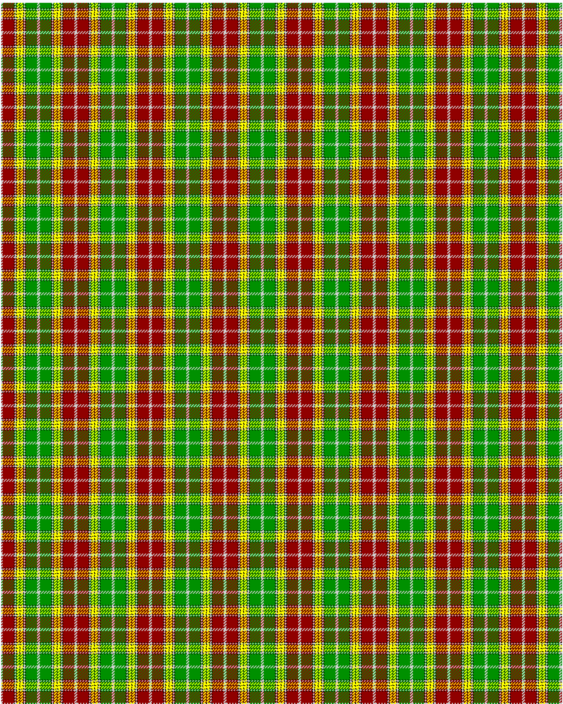

Buchanan D1

This was sourced from <no value>.  It is a 13 stripes tartan.

Original link http://www.weddslist.com/cgi-bin/tartans/pg.pl?source=rb

## Thread count
N/2 DR16 K1 N2 K1 Y4 K1 Y4 K1 N2 K1 G16 N/2

## Palette
DR#900000 G#009000 K#000000 N#D0D0D0 Y#FFFF00

# Sample pattern

ID: N/2/DR16/K1/N2/K1/Y4/K1/Y4/K1/N2/K1/G16/N/2-DR$900000 G$009000 K$000000 N$D0D0D0 Y$FFFF00