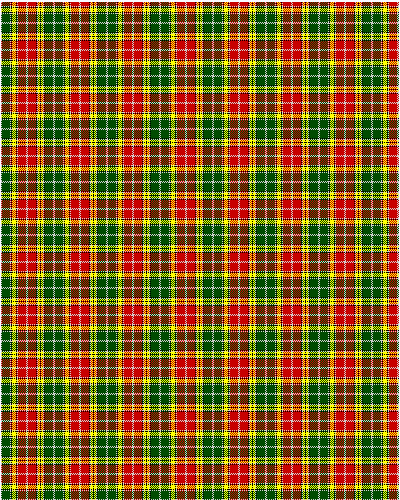

Buchanan D

This was sourced from <no value>.  It is a 13 stripes tartan.

Original link http://www.weddslist.com/cgi-bin/tartans/pg.pl?source=rb

## Thread count
N/2 G16 K1 N2 K1 Y4 K1 Y4 K1 N2 K1 R16 N/2

## Palette
G#004C00 K#000000 N#D0D0D0 R#C80000 Y#FFFF00

# Sample pattern

ID: N/2/G16/K1/N2/K1/Y4/K1/Y4/K1/N2/K1/R16/N/2-G$004C00 K$000000 N$D0D0D0 R$C80000 Y$FFFF00