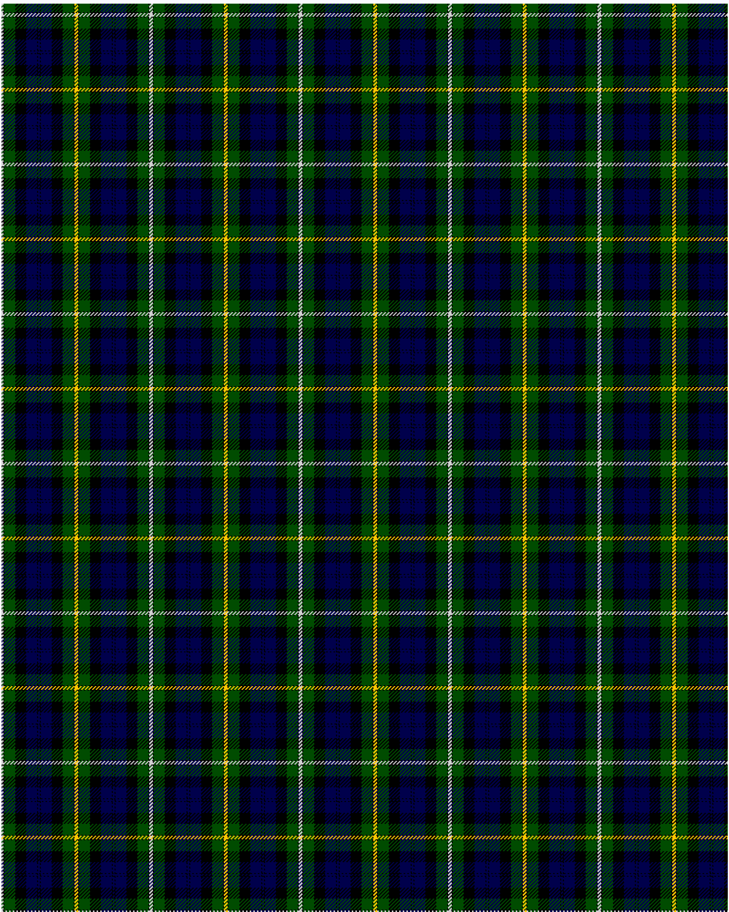

Campbell Loudon

This was sourced from <no value>.  It is a 13 stripes tartan.

Original link http://www.weddslist.com/cgi-bin/tartans/pg.pl?source=rb

## Thread count
N/2 K1 G12 K12 DB12 K1 DB2 K1 DB12 K12 G12 K1 Y/2

## Palette
DB#00004C G#004C00 K#000000 N#D0D0D0 Y#FFC800

# Sample pattern

ID: N/2/K1/G12/K12/DB12/K1/DB2/K1/DB12/K12/G12/K1/Y/2-DB$00004C G$004C00 K$000000 N$D0D0D0 Y$FFC800