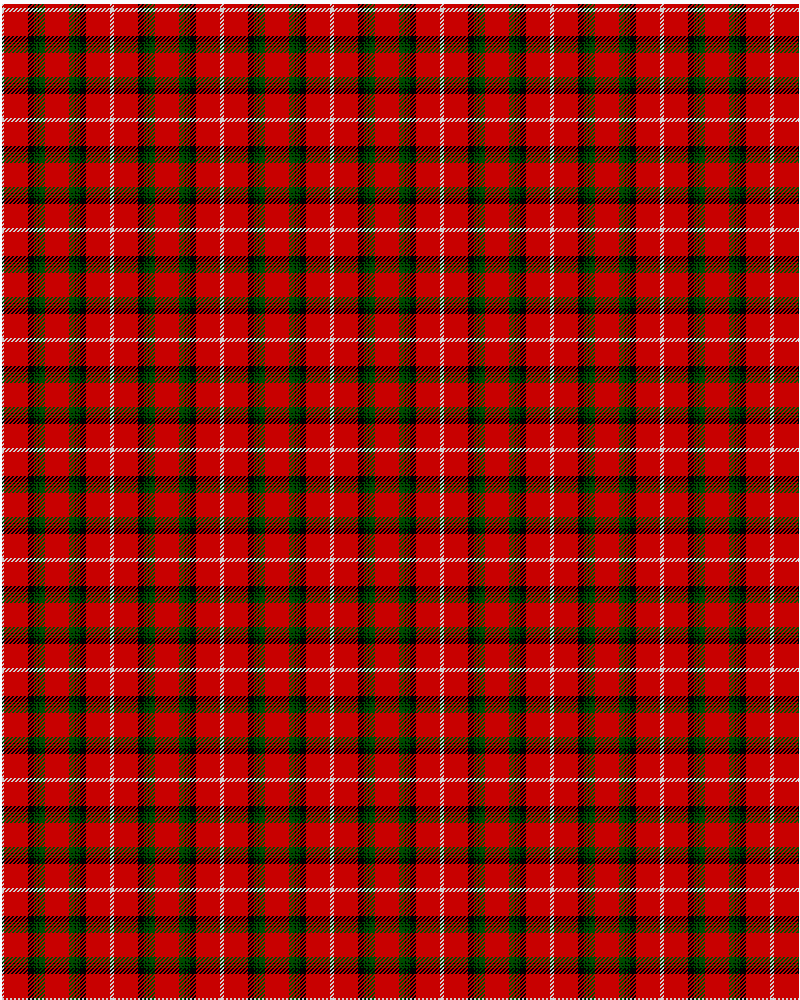

Stuart of Bute

This was sourced from <no value>.  It is a 9 stripes tartan.

Original link http://www.weddslist.com/cgi-bin/tartans/pg.pl?source=rb

## Thread count
N/2 R24 K6 G1 K1 G2 K1 G6 R/12

## Palette
G#004C00 K#000000 N#D0D0D0 R#C80000

# Sample pattern

ID: N/2/R24/K6/G1/K1/G2/K1/G6/R/12-G$004C00 K$000000 N$D0D0D0 R$C80000