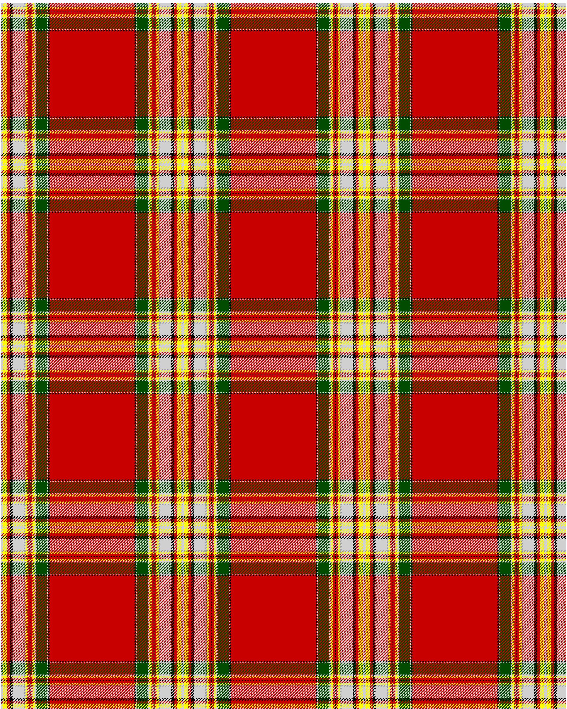

Clan Chattan D

This was sourced from <no value>.  It is a 16 stripes tartan.

Original link http://www.weddslist.com/cgi-bin/tartans/pg.pl?source=rb

## Thread count
N/2 Y6 R4 K4 N16 NA2 Y3 R3 K1 R3 Y3 N2 G16 N1 K2 R/60

## Palette
G#004C00 K#000000 N#D0D0D0 NA#A0A0A0 R#C80000 Y#FFFF00

# Sample pattern

ID: N/2/Y6/R4/K4/N16/NA2/Y3/R3/K1/R3/Y3/N2/G16/N1/K2/R/60-G$004C00 K$000000 N$D0D0D0 NA$A0A0A0 R$C80000 Y$FFFF00