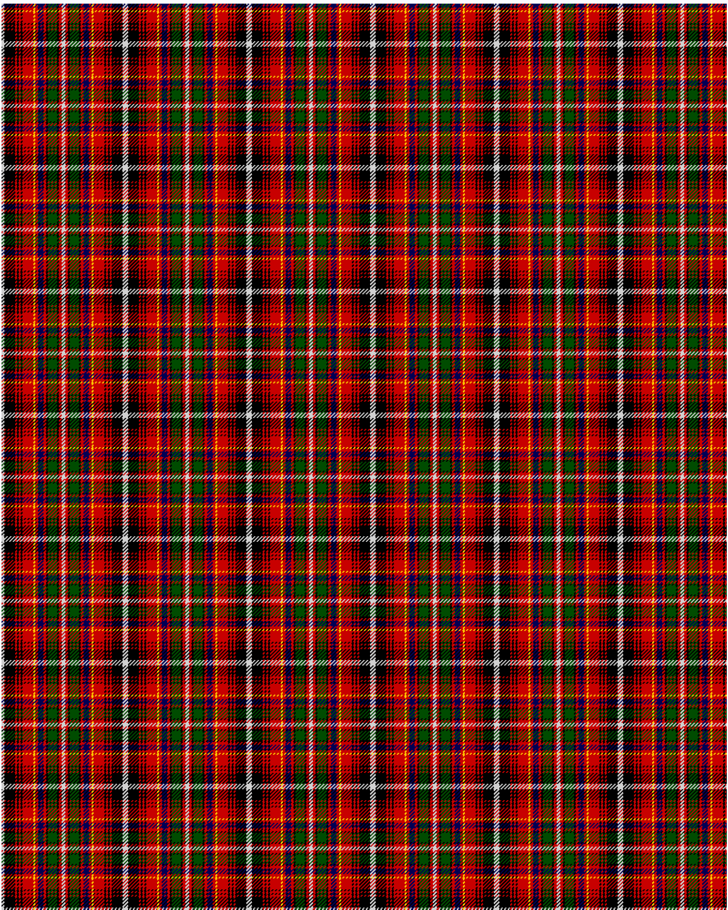

Innes D

This was sourced from <no value>.  It is a 16 stripes tartan.

Original link http://www.weddslist.com/cgi-bin/tartans/pg.pl?source=rb

## Thread count
N/3 K12 R2 K2 R2 K2 R12 Y2 R3 DB6 R3 K2 G10 K2 R3 N/2

## Palette
DB#000054 G#004C00 K#000000 N#D0D0D0 R#C80000 Y#FFC800

# Sample pattern

ID: N/3/K12/R2/K2/R2/K2/R12/Y2/R3/DB6/R3/K2/G10/K2/R3/N/2-DB$000054 G$004C00 K$000000 N$D0D0D0 R$C80000 Y$FFC800