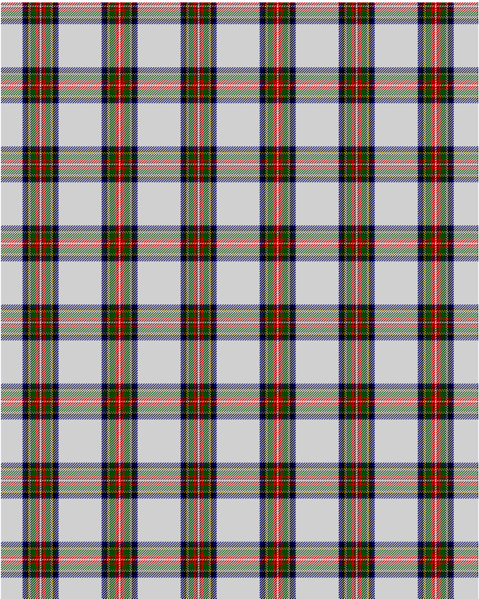

Stewart Dress

This was sourced from <no value>.  It is a 12 stripes tartan.

Original link http://www.weddslist.com/cgi-bin/tartans/pg.pl?source=rb

## Thread count
N/36 DB5 K5 Y1 K1 N1 K1 G8 R4 K1 R2 N/1

## Palette
DB#000060 G#004C00 K#000000 N#D0D0D0 R#C80000 Y#FFC800

# Sample pattern

ID: N/36/DB5/K5/Y1/K1/N1/K1/G8/R4/K1/R2/N/1-DB$000060 G$004C00 K$000000 N$D0D0D0 R$C80000 Y$FFC800