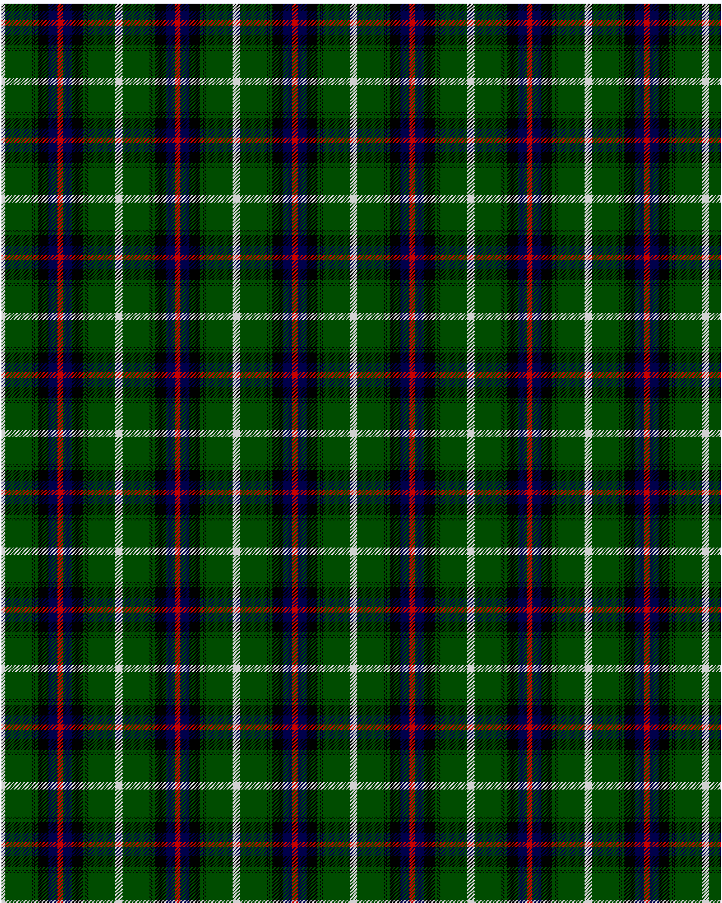

MacDonnald of ye Ylis

This was sourced from <no value>.  It is a 9 stripes tartan.

Original link http://www.weddslist.com/cgi-bin/tartans/pg.pl?source=rb

## Thread count
N/4 G30 K1 G1 K1 G3 K12 DB10 R/3

## Palette
DB#00004C G#004C00 K#000000 N#D0D0D0 R#C80000

# Sample pattern

ID: N/4/G30/K1/G1/K1/G3/K12/DB10/R/3-DB$00004C G$004C00 K$000000 N$D0D0D0 R$C80000