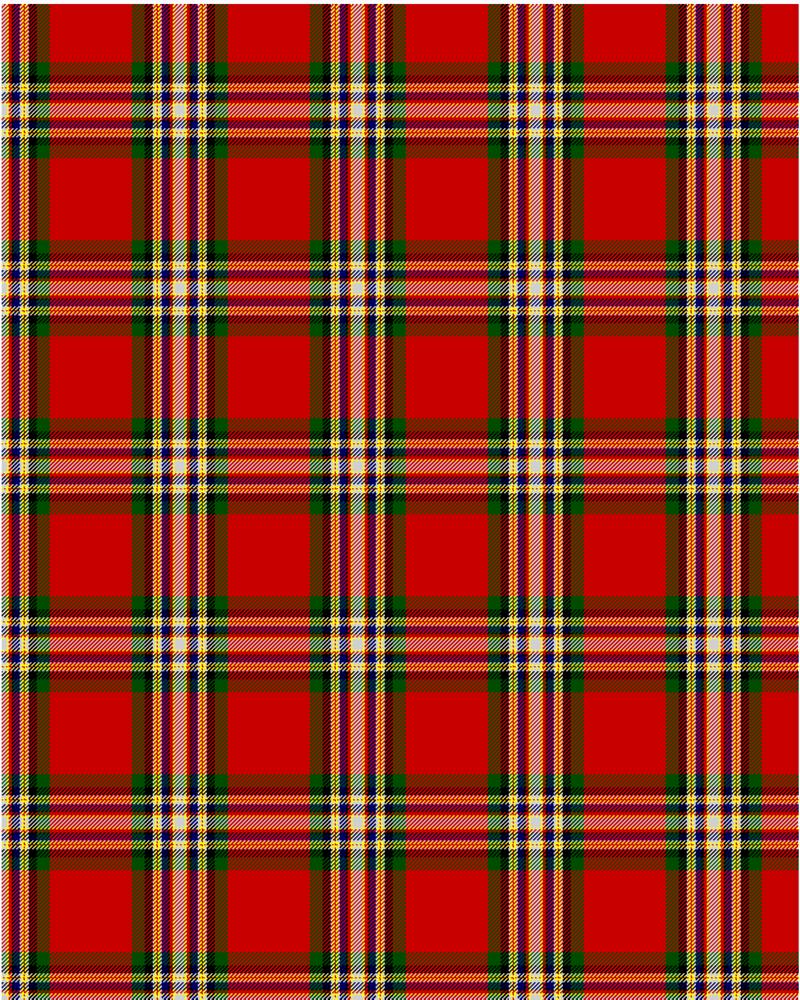

MacGill

This was sourced from <no value>.  It is a 13 stripes tartan.

Original link http://www.weddslist.com/cgi-bin/tartans/pg.pl?source=rb

## Thread count
N/5 Y2 R3 K2 DB6 N2 Y2 R1 Y2 N2 K8 G13 R/41

## Palette
DB#000064 G#004C00 K#000000 N#D0D0D0 R#C80000 Y#FFFF00

# Sample pattern

ID: N/5/Y2/R3/K2/DB6/N2/Y2/R1/Y2/N2/K8/G13/R/41-DB$000064 G$004C00 K$000000 N$D0D0D0 R$C80000 Y$FFFF00