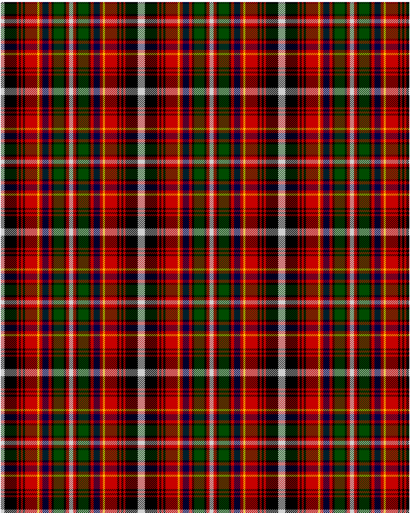

Innes

This was sourced from <no value>.  It is a 16 stripes tartan.

Original link http://www.weddslist.com/cgi-bin/tartans/pg.pl?source=rb

## Thread count
N/7 K24 R4 K4 R4 K4 R24 Y4 R6 DB12 R6 K4 G20 K4 R6 N/4

## Palette
DB#00004C G#004C00 K#000000 N#D0D0D0 R#C80000 Y#FFC800

# Sample pattern

ID: N/7/K24/R4/K4/R4/K4/R24/Y4/R6/DB12/R6/K4/G20/K4/R6/N/4-DB$00004C G$004C00 K$000000 N$D0D0D0 R$C80000 Y$FFC800