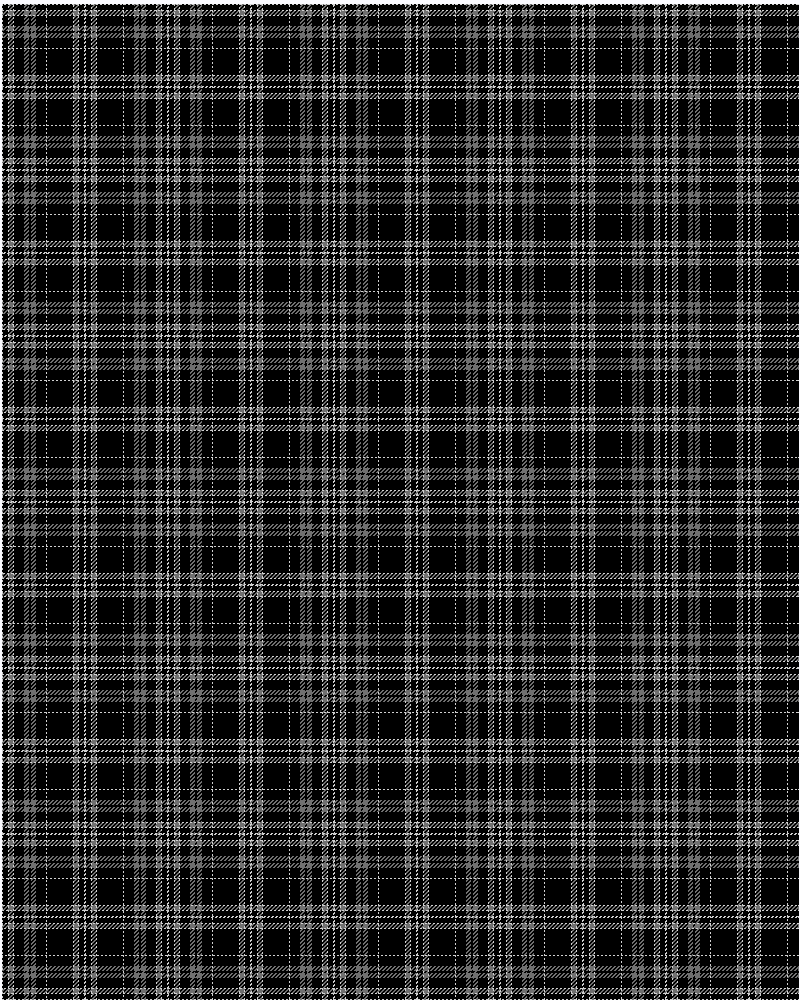

Clergy

This was sourced from <no value>.  It is a 17 stripes tartan.

Original link http://www.weddslist.com/cgi-bin/tartans/pg.pl?source=rb

## Thread count
NA/1 K5 NA1 N4 NA1 K10 N5 K2 N5 K10 NA1 K26 NA1 N4 NA1 K5 NA/1

## Palette
K#000000 N#707070 NA#D0D0D0

# Sample pattern

ID: NA/1/K5/NA1/N4/NA1/K10/N5/K2/N5/K10/NA1/K26/NA1/N4/NA1/K5/NA/1-K$000000 N$707070 NA$D0D0D0