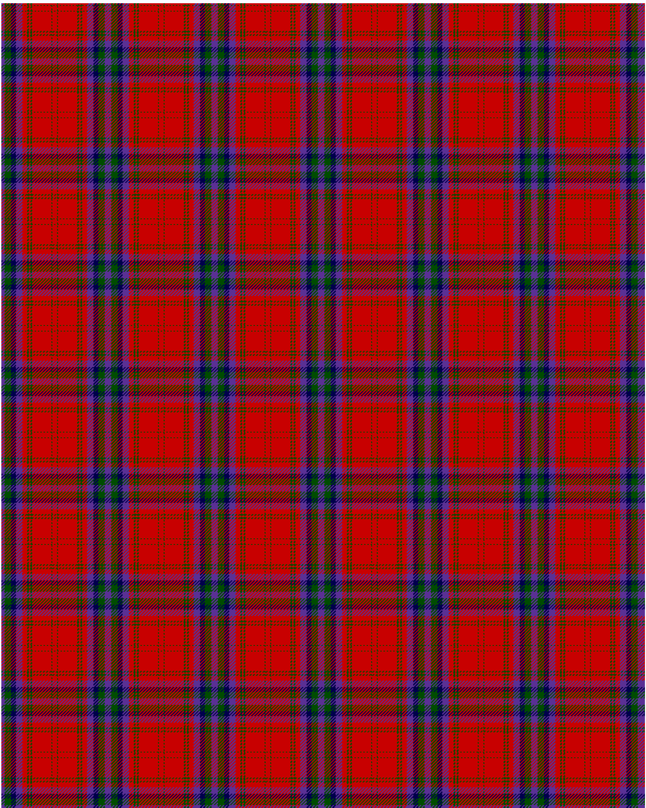

MacDougall VS

This was sourced from <no value>.  It is a 11 stripes tartan.

Original link http://www.weddslist.com/cgi-bin/tartans/pg.pl?source=rb

## Thread count
P/4 G8 DB6 P8 R6 G2 R2 G2 R24 G1 R/3

## Palette
DB#00004C G#004C00 P#5A3094 R#C80000

# Sample pattern

ID: P/4/G8/DB6/P8/R6/G2/R2/G2/R24/G1/R/3-DB$00004C G$004C00 P$5A3094 R$C80000