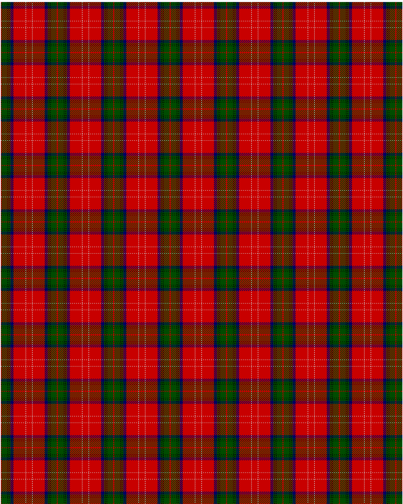

Chisholm VS

This was sourced from <no value>.  It is a 10 stripes tartan.

Original link http://www.weddslist.com/cgi-bin/tartans/pg.pl?source=rb

## Thread count
R/1 G12 K1 G2 K1 G2 DB6 R24 N1 R/6

## Palette
DB#000064 G#004C00 K#000000 N#D0D0D0 R#C80000

# Sample pattern

ID: R/1/G12/K1/G2/K1/G2/DB6/R24/N1/R/6-DB$000064 G$004C00 K$000000 N$D0D0D0 R$C80000