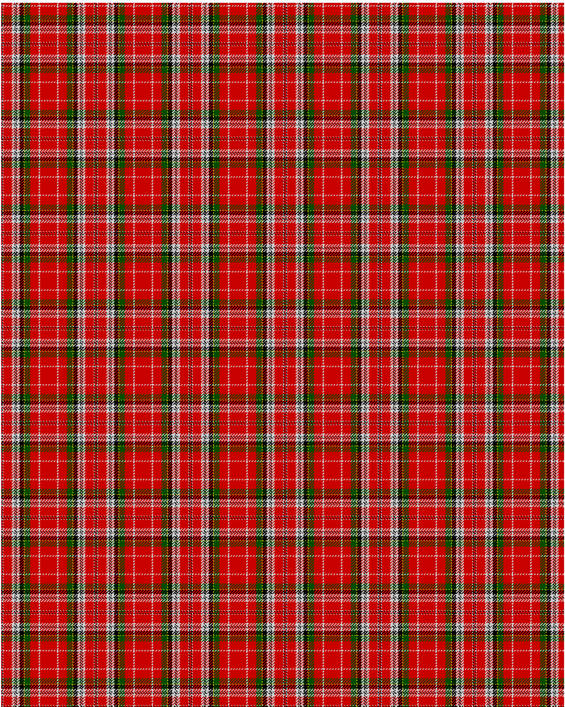

MacPherson

This was sourced from <no value>.  It is a 15 stripes tartan.

Original link http://www.weddslist.com/cgi-bin/tartans/pg.pl?source=rb

## Thread count
R/1 K1 N1 R12 N4 K1 N1 K1 N4 K6 Y1 G8 R12 N2 R/12

## Palette
G#004C00 K#000000 N#D0D0D0 R#C80000 Y#C8C800

# Sample pattern

ID: R/1/K1/N1/R12/N4/K1/N1/K1/N4/K6/Y1/G8/R12/N2/R/12-G$004C00 K$000000 N$D0D0D0 R$C80000 Y$C8C800