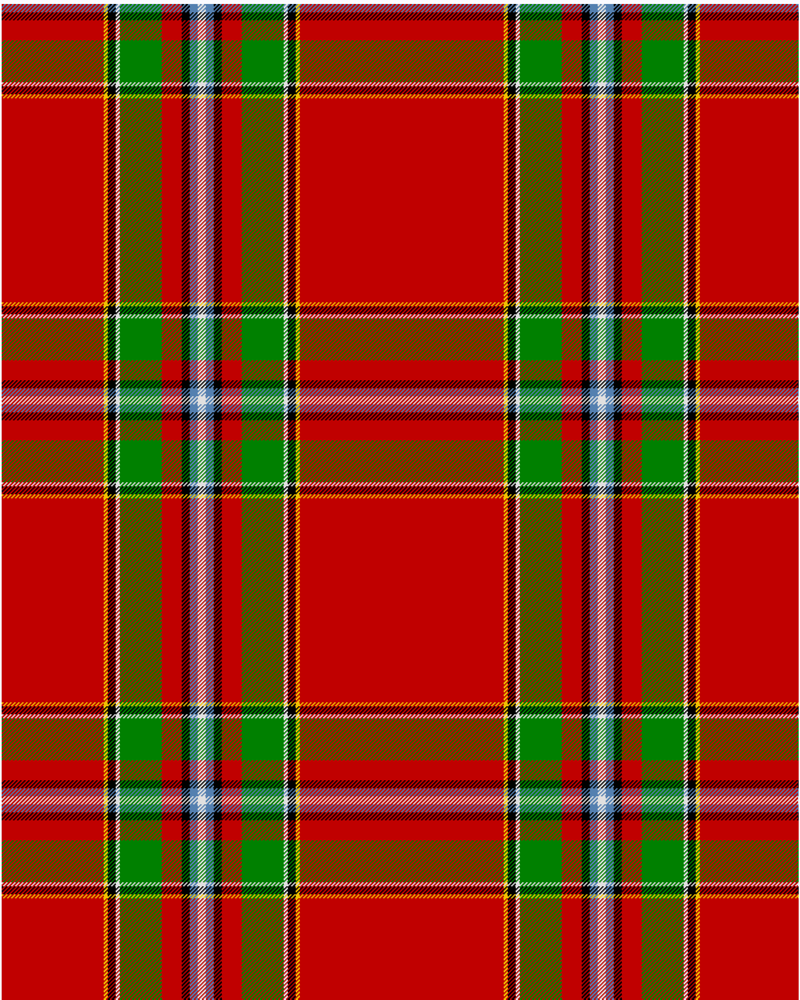

Drummond of Perth

This was sourced from <no value>.  It is a 9 stripes tartan.

Original link http://www.weddslist.com/cgi-bin/tartans/pg.pl?source=sts

## Thread count
R/102 Y4 K8 W4 G42 R20 K8 LB8 W/4

## Palette
G#008000 K#000000 LB#5480B0 R#C00000 W#E0E0E0 Y#F0C000

# Sample pattern

ID: R/102/Y4/K8/W4/G42/R20/K8/LB8/W/4-G$008000 K$000000 LB$5480B0 R$C00000 W$E0E0E0 Y$F0C000