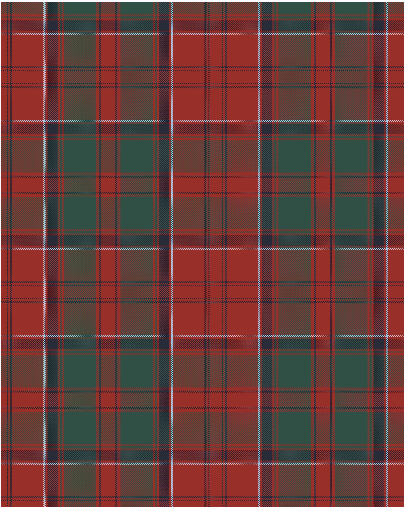

Drummond 1997 Kilt

This was sourced from <no value>.  It is a 15 stripes tartan.

Original link https://tartandictionary.org/posts/drummondsofmegginchkilt/

## Thread count
R/12 DB2 R4 DB4 R62 LB4 R4 DB20 R4 G4 R4 G64 R6 DB4 R/14

## Palette
DB#282C39 G#304F45 LB#98C8E8 R#983029

# Sample pattern

ID: R/12/DB2/R4/DB4/R62/LB4/R4/DB20/R4/G4/R4/G64/R6/DB4/R/14-DB$282C39 G$304F45 LB$98C8E8 R$983029