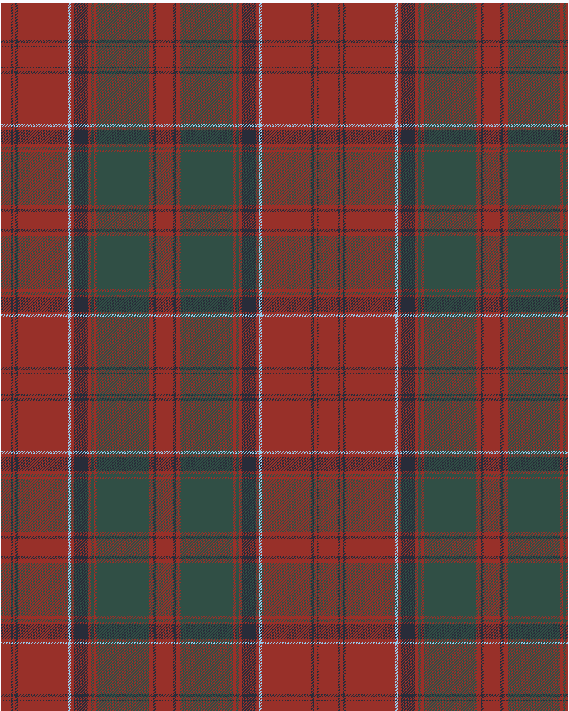

Drummond 1849 Kilt

This was sourced from <no value>.  It is a 15 stripes tartan.

Original link https://tartandictionary.org/posts/drummondsofmeggincholdkilt/

## Thread count
R/14 DB2 R4 DB4 R70 LB4 R4 DB20 R4 G4 R4 G74 R6 DB4 R/12

## Palette
DB#282C39 G#304F45 LB#98C8E8 R#983029

# Sample pattern

ID: R/14/DB2/R4/DB4/R70/LB4/R4/DB20/R4/G4/R4/G74/R6/DB4/R/12-DB$282C39 G$304F45 LB$98C8E8 R$983029