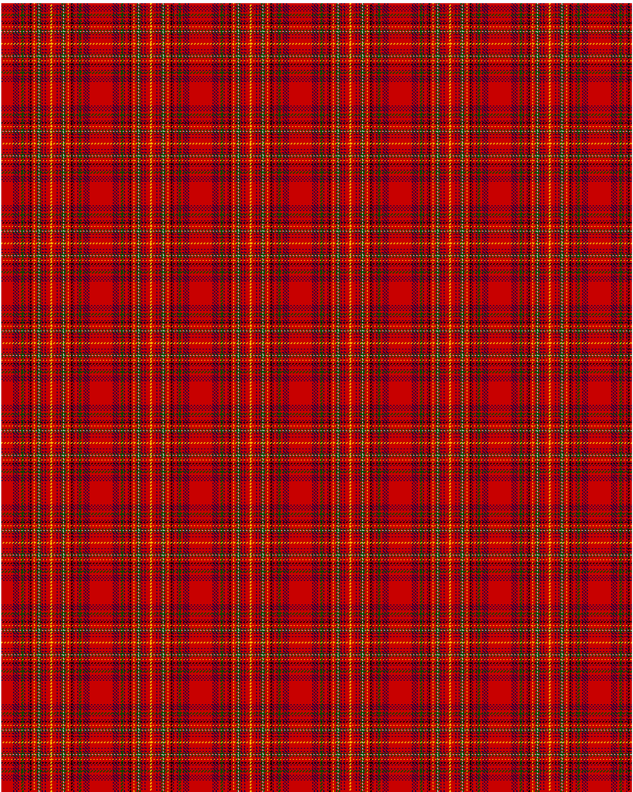

MacDonald of Staffa

This was sourced from <no value>.  It is a 28 stripes tartan.

Original link http://www.weddslist.com/cgi-bin/tartans/pg.pl?source=rb

## Thread count
R/15 DB1 R1 DB1 R1 DB1 R1 DB1 R3 G3 R1 DB1 R4 DB1 R1 K2 R3 Y1 R3 G2 N1 G2 R1 DB1 R3 DB1 R6 Y/1

## Palette
DB#00004C G#004C00 K#000000 N#D0D0D0 R#C80000 Y#FFC800

# Sample pattern

ID: R/15/DB1/R1/DB1/R1/DB1/R1/DB1/R3/G3/R1/DB1/R4/DB1/R1/K2/R3/Y1/R3/G2/N1/G2/R1/DB1/R3/DB1/R6/Y/1-DB$00004C G$004C00 K$000000 N$D0D0D0 R$C80000 Y$FFC800