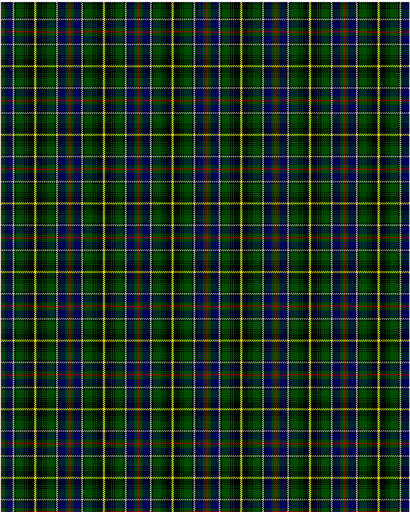

MacInnes

This was sourced from <no value>.  It is a 13 stripes tartan.

Original link http://www.weddslist.com/cgi-bin/tartans/pg.pl?source=rb

## Thread count
R/2 G6 DB12 K3 N3 K3 G16 K2 G2 K2 G2 K12 Y/2

## Palette
DB#000064 G#004C00 K#000000 N#D0D0D0 R#C80000 Y#FFFF00

# Sample pattern

ID: R/2/G6/DB12/K3/N3/K3/G16/K2/G2/K2/G2/K12/Y/2-DB$000064 G$004C00 K$000000 N$D0D0D0 R$C80000 Y$FFFF00