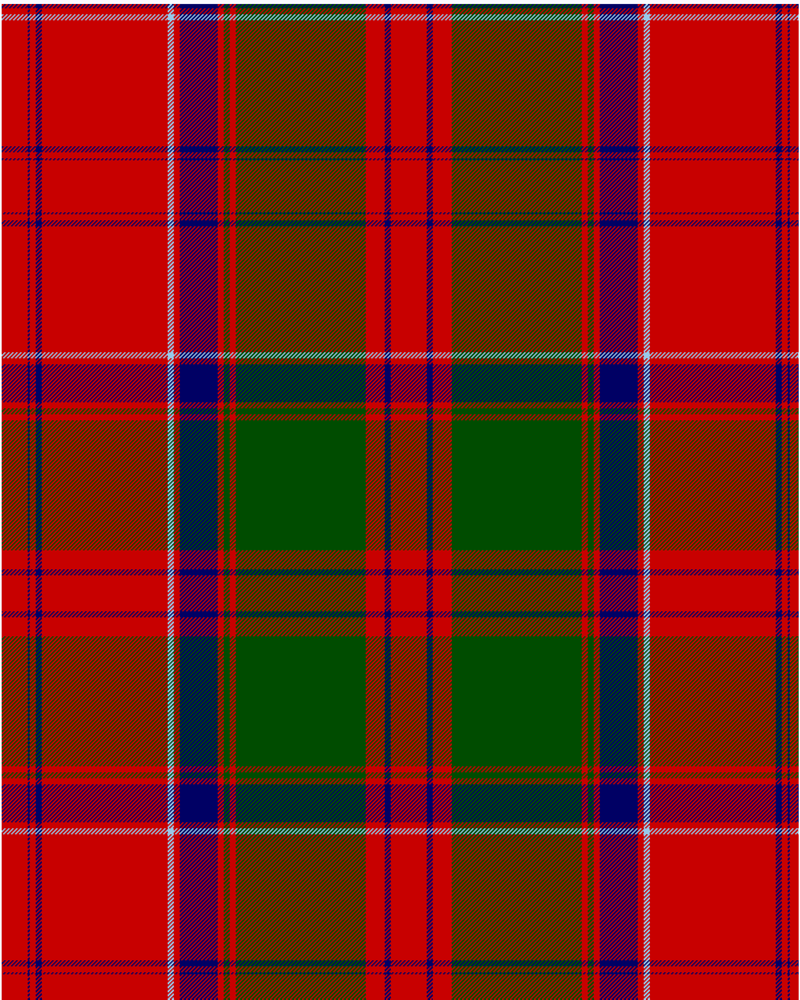

Drummond 1820 Plaid

This was sourced from <no value>.  It is a 15 stripes tartan.

Original link https://tartandictionary.org/posts/drummondsofmeggincholdplaid/

## Thread count
R/26 DB2 R6 DB6 R126 LB6 R6 DB38 R6 G6 R6 G130 R19 DB6 R/18

## Palette
DB#000064 G#004C00 LB#98C8E8 R#C80000

# Sample pattern

ID: R/26/DB2/R6/DB6/R126/LB6/R6/DB38/R6/G6/R6/G130/R19/DB6/R/18-DB$000064 G$004C00 LB$98C8E8 R$C80000