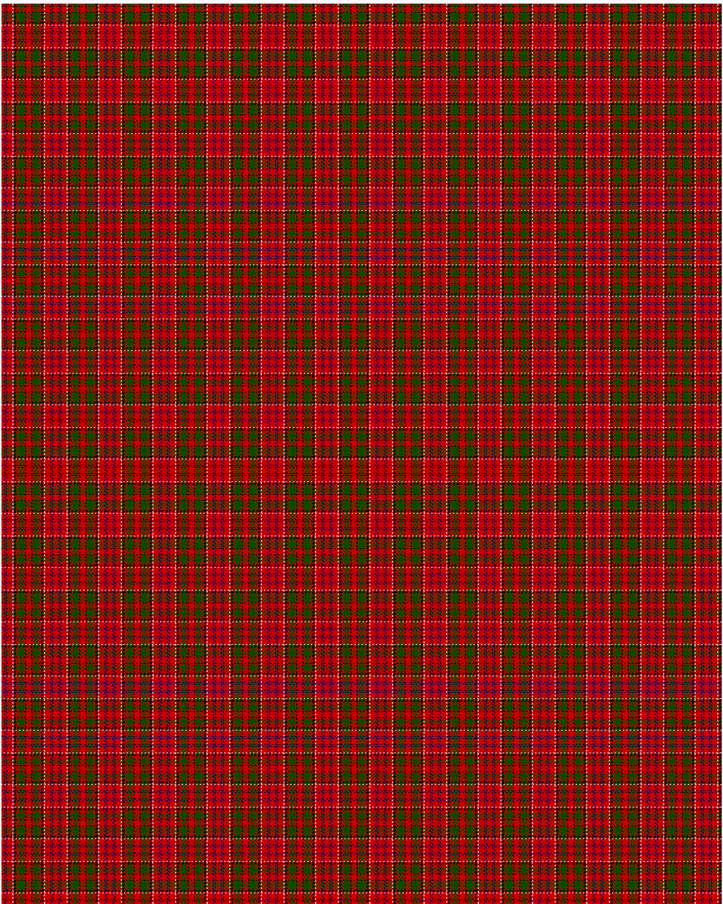

Drummond C

This was sourced from <no value>.  It is a 15 stripes tartan.

Original link http://www.weddslist.com/cgi-bin/tartans/pg.pl?source=rb

## Thread count
R/3 B1 R1 B1 R6 W1 R1 K2 R1 G1 R1 G6 R1 K1 R/3

## Palette
B#000064 G#004C00 K#000000 R#C80000 W#D0D0D0

# Sample pattern

ID: R/3/B1/R1/B1/R6/W1/R1/K2/R1/G1/R1/G6/R1/K1/R/3-B$000064 G$004C00 K$000000 R$C80000 W$D0D0D0