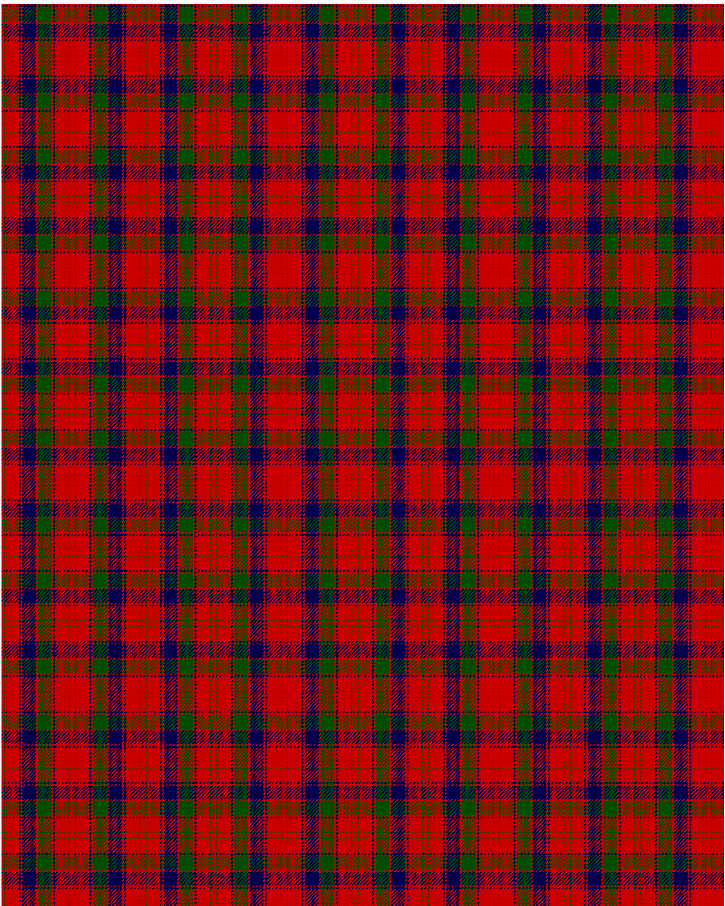

Robertson D

This was sourced from <no value>.  It is a 13 stripes tartan.

Original link http://www.weddslist.com/cgi-bin/tartans/pg.pl?source=rb

## Thread count
R/3 G1 R15 DB2 R2 DB15 R2 G15 R2 DB2 R15 G1 R/3

## Palette
DB#00004C G#004C00 R#C80000

# Sample pattern

ID: R/3/G1/R15/DB2/R2/DB15/R2/G15/R2/DB2/R15/G1/R/3-DB$00004C G$004C00 R$C80000