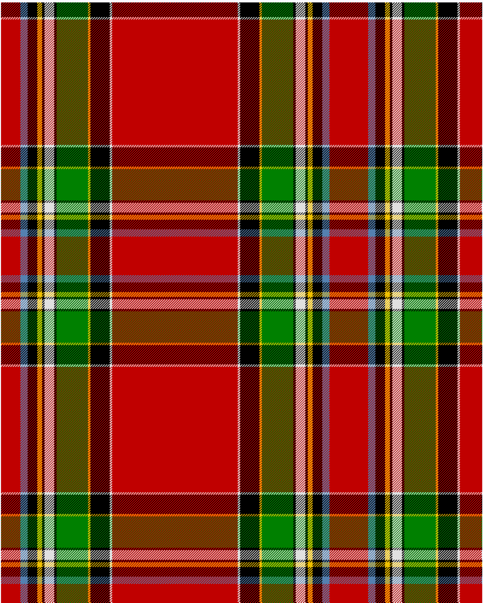

Drummond, Relic

This was sourced from <no value>.  It is a 12 stripes tartan.

Original link http://www.weddslist.com/cgi-bin/tartans/pg.pl?source=sts

## Thread count
R/32 LB12 K16 Y8 K4 W16 K4 G52 Y4 K32 W4 R/104

## Palette
G#008000 K#000000 LB#5480B0 R#C00000 W#E0E0E0 Y#F0C000

# Sample pattern

ID: R/32/LB12/K16/Y8/K4/W16/K4/G52/Y4/K32/W4/R/104-G#008000 K#000000 LB#5480B0 R#C00000 W#E0E0E0 Y#F0C000