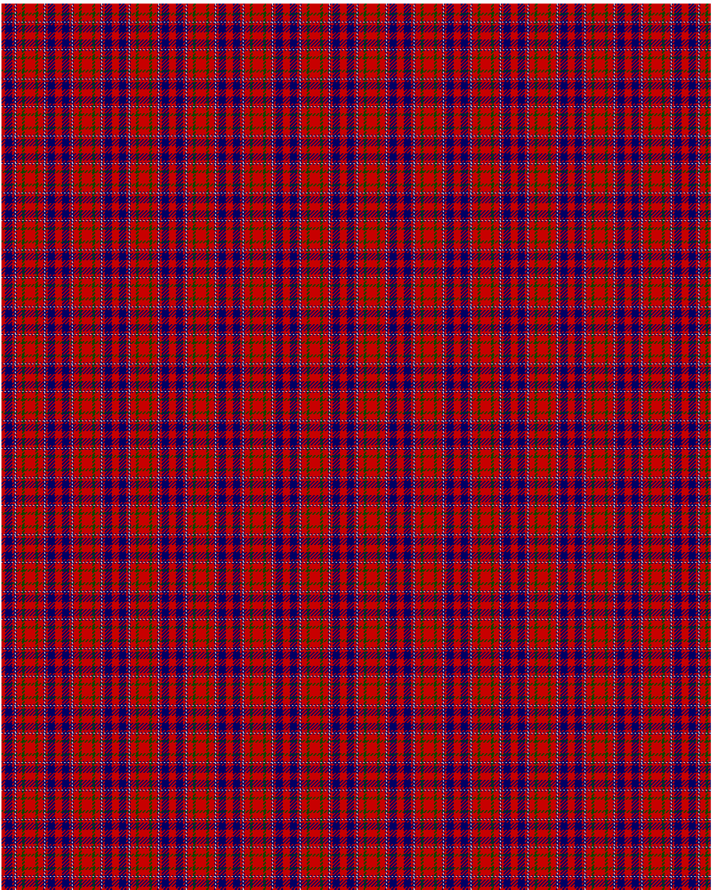

Cameron of Locheil

This was sourced from <no value>.  It is a 9 stripes tartan.

Original link http://www.weddslist.com/cgi-bin/tartans/pg.pl?source=rb

## Thread count
R/4 DB8 R2 DB1 N1 DB1 R6 G3 R/6

## Palette
DB#000064 G#004C00 N#D0D0D0 R#C80000

# Sample pattern

ID: R/4/DB8/R2/DB1/N1/DB1/R6/G3/R/6-DB$000064 G$004C00 N$D0D0D0 R$C80000