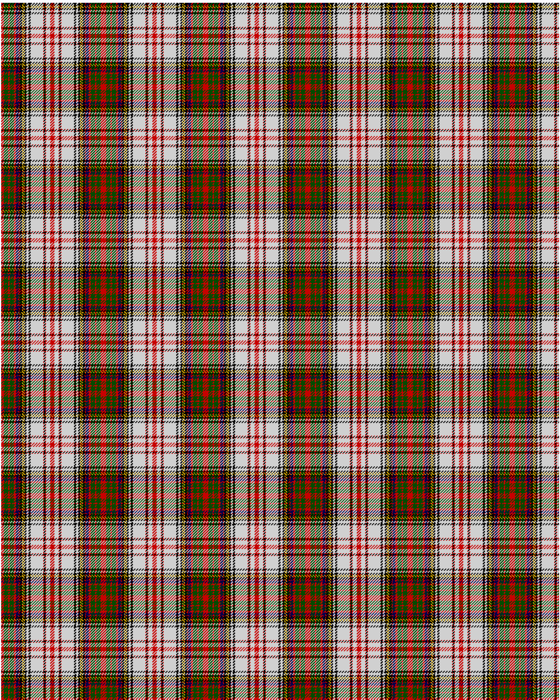

Anderson

This was sourced from <no value>.  It is a 20 stripes tartan.

Original link http://www.weddslist.com/cgi-bin/tartans/pg.pl?source=rb

## Thread count
R/4 G6 R2 G6 R3 DB4 R1 K4 Y1 K1 Y1 K3 N3 K3 N18 R1 K2 R1 N6 R/3

## Palette
DB#00004C G#004C00 K#000000 N#D0D0D0 R#C80000 Y#FFC800

# Sample pattern

ID: R/4/G6/R2/G6/R3/DB4/R1/K4/Y1/K1/Y1/K3/N3/K3/N18/R1/K2/R1/N6/R/3-DB$00004C G$004C00 K$000000 N$D0D0D0 R$C80000 Y$FFC800