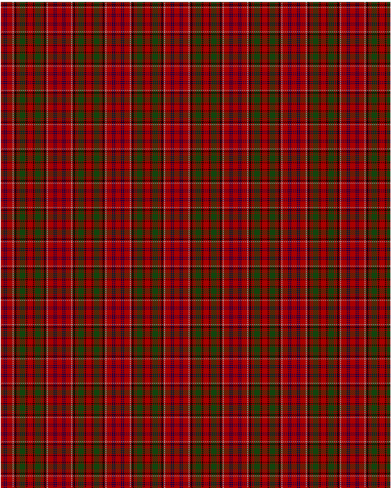

Drummond C

This was sourced from <no value>.  It is a 15 stripes tartan.

Original link http://www.weddslist.com/cgi-bin/tartans/pg.pl?source=tinsel

## Thread count
R/6 B2 R2 B2 R12 W2 R2 K4 R2 G2 R2 G12 R2 K2 R/6

## Palette
B#000052 G#11450D K#000000 R#AA0000 W#AAAAAA

# Sample pattern

ID: R/6/B2/R2/B2/R12/W2/R2/K4/R2/G2/R2/G12/R2/K2/R/6-B$000052 G$11450D K$000000 R$AA0000 W$AAAAAA