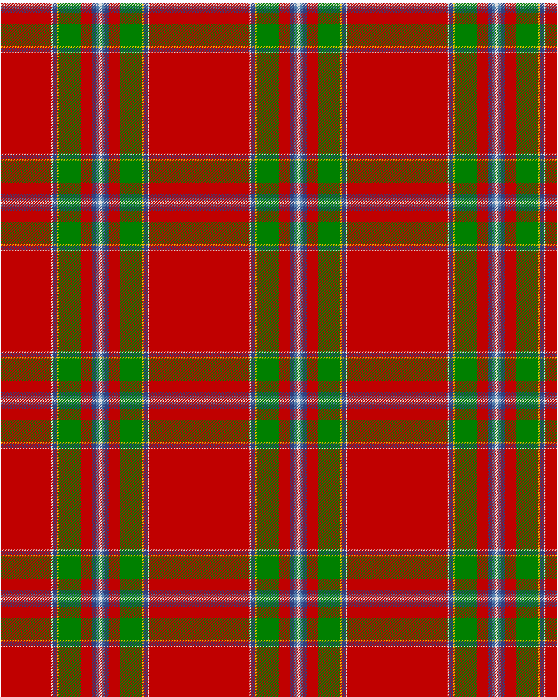

Drummond of Perth

This was sourced from <no value>.  It is a 9 stripes tartan.

Original link http://www.weddslist.com/cgi-bin/tartans/pg.pl?source=sts

## Thread count
R/72 W2 B6 Y2 G32 R16 B6 LB4 W/2

## Palette
B#304080 G#008000 LB#5480B0 R#C00000 W#E0E0E0 Y#F0C000

# Sample pattern

ID: R/72/W2/B6/Y2/G32/R16/B6/LB4/W/2-B#304080 G#008000 LB#5480B0 R#C00000 W#E0E0E0 Y#F0C000