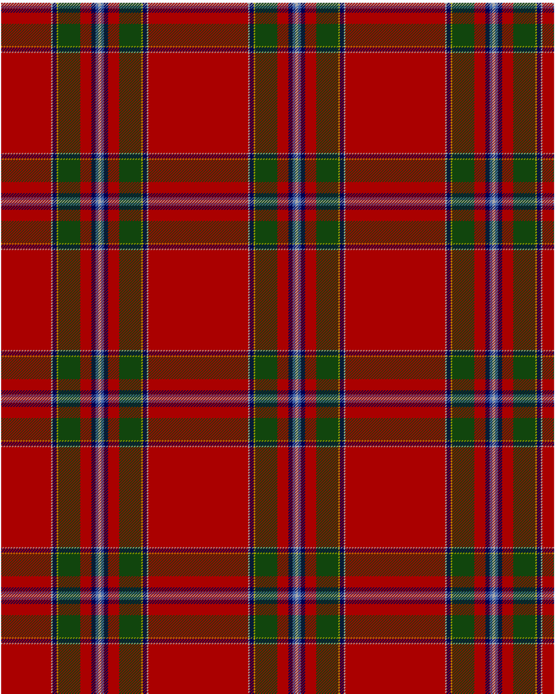

Drummond of Perth

This was sourced from <no value>.  It is a 9 stripes tartan.

Original link http://www.weddslist.com/cgi-bin/tartans/pg.pl?source=tinsel

## Thread count
R/72 W2 B6 Y2 G32 R16 B6 LB4 W/2

## Palette
B#000052 G#11450D LB#4367AE R#AA0000 W#AAAAAA Y#AAAA00

# Sample pattern

ID: R/72/W2/B6/Y2/G32/R16/B6/LB4/W/2-B$000052 G$11450D LB$4367AE R$AA0000 W$AAAAAA Y$AAAA00