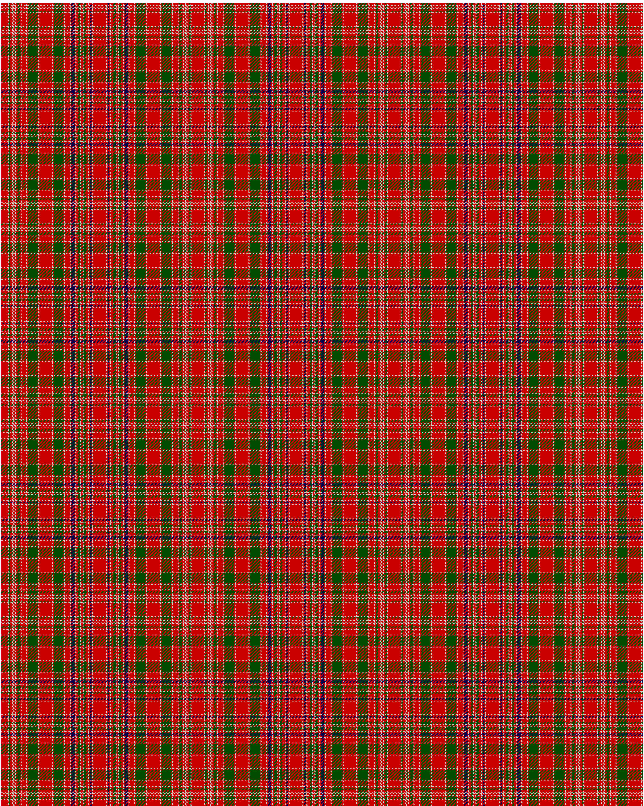

MacAlister

This was sourced from <no value>.  It is a 44 stripes tartan.

Original link http://www.weddslist.com/cgi-bin/tartans/pg.pl?source=rb

## Thread count
R/8 N1 G2 R2 N1 R1 N1 R1 N1 R2 G3 R1 N1 R6 N1 R1 G12 R1 N1 R16 N1 R1 G12 R1 N1 R6 N1 R1 DB4 R1 N1 R2 G3 N1 R2 N1 G3 R3 N1 R1 DB2 R1 N1 R/8

## Palette
DB#00004C G#004C00 N#D0D0D0 R#C80000

# Sample pattern

ID: R/8/N1/G2/R2/N1/R1/N1/R1/N1/R2/G3/R1/N1/R6/N1/R1/G12/R1/N1/R16/N1/R1/G12/R1/N1/R6/N1/R1/DB4/R1/N1/R2/G3/N1/R2/N1/G3/R3/N1/R1/DB2/R1/N1/R/8-DB$00004C G$004C00 N$D0D0D0 R$C80000