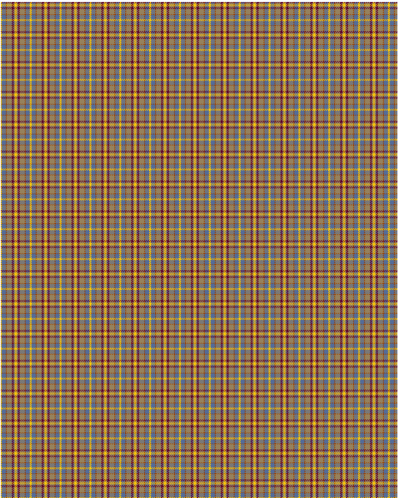

Deeside District

This was sourced from <no value>.  It is a 7 stripes tartan.

Original link http://www.weddslist.com/cgi-bin/tartans/pg.pl?source=rb

## Thread count
Y/2 B8 R2 LT10 DR4 LT2 YA/2

## Palette
B#536C9A DR#5D002C LT#96815C R#9B4000 Y#FFC800 YA#FFC800

# Sample pattern

ID: Y/2/B8/R2/LT10/DR4/LT2/YA/2-B$536C9A DR$5D002C LT$96815C R$9B4000 Y$FFC800 YA$FFC800