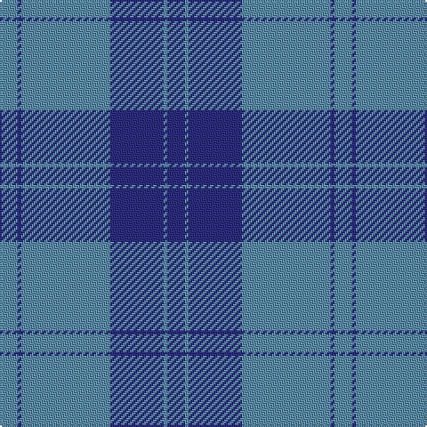

The parent of this is [Dram! (Corporate)](/tartans/b/10/db2/b50/db30/b2/db/10/)

This was sourced from tartans-authority.  It is a [6 stripes tartan](/stripes/stripes6/).

Original link http://www.tartansauthority.com/tartan-ferret/display/7532/

## Thread count
B/10 DB2 B50 DB30 B2 DB/10

## Palette
Each colour and its ΔE from the base-6 reference it is a variant of.

| Colour | Shade | Base | ΔE (OKLab) |
|---|---|---|---|
| B |  `#5C8CA8` | B  | 0.23 |
| DB |  `#2C2C80` | B  | 0.05 |

# Sample pattern

ID: /variants/b/10/db2/b50/db30/b2/db/10-b5c8ca8-db2c2c80/
