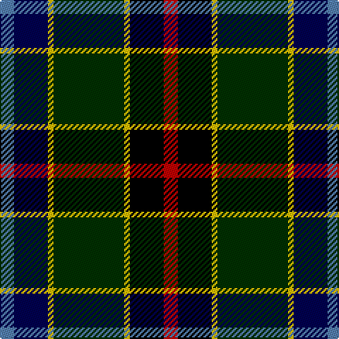

The parent of this is [James](/tartans/b/10/db24/y4/dg50/y4/k24/r/10/)

This was sourced from weddslist.  It is a [7 stripes tartan](/stripes/stripes7/).

Original link http://www.weddslist.com/cgi-bin/tartans/pg.pl?source=sts

## Thread count
B/10 DB24 Y4 DG50 Y4 K24 R/10

## Palette
Each colour and its ΔE from the base-6 reference it is a variant of.

| Colour | Shade | Base | ΔE (OKLab) |
|---|---|---|---|
| B |  `#5480B0` | B  | 0.20 |
| DB |  `#000050` | B  | 0.20 |
| DG |  `#003000` | G  | 0.18 |
| K |  `#000000` | K  | 0.00 |
| R |  `#C00000` | R  | 0.02 |
| Y |  `#F0C000` | Y  | 0.01 |

# Sample pattern

ID: /variants/b/10/db24/y4/dg50/y4/k24/r/10-b5480b0-db000050-dg003000-k000000-rc00000-yf0c000/
