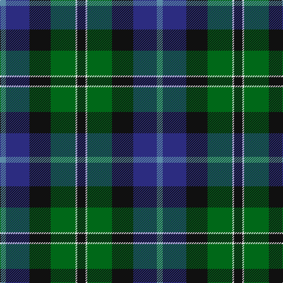

The parent of this is [New York Firemen's Pipe Band Corporate Tartan Tartan Number: 60. Earliest known date: 1964 Nothing See products available Copyright © Blair Urquhart, Comrie, 2015](/tartans/b/10/db40/k36/g42/ln3/k/14/)

This was sourced from house-of-tartan.  It is a [6 stripes tartan](/stripes/stripes6/).

Original link http://www.house-of-tartan.scotland.net/house/TartanViewjs.asp?colr=Def&tnam=60

## Thread count
B/10 DB40 K36 G42 LN3 K/14

## Palette
Each colour and its ΔE from the base-6 reference it is a variant of.

| Colour | Shade | Base | ΔE (OKLab) |
|---|---|---|---|
| B |  `#5C8CA8` | B  | 0.23 |
| DB |  `#2C2C80` | B  | 0.05 |
| G |  `#006818` | G  | 0.02 |
| K |  `#101010` | K  | 0.17 |
| LN |  `#E0E0E0` | W  | 0.06 |

# Sample pattern

ID: /variants/b/10/db40/k36/g42/ln3/k/14-b5c8ca8-db2c2c80-g006818-k101010-lne0e0e0/
