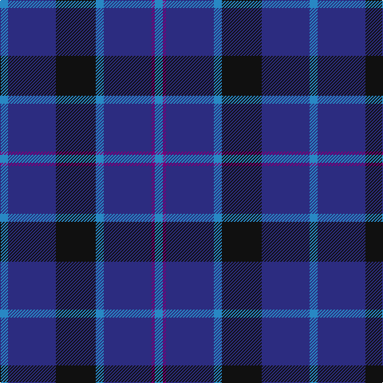

The parent of this is [Van Loo (Personal)](/tartans/b/10/db60/k50/b10/db60/p4/b/10/)

This was sourced from tartans-authority.  It is a [7 stripes tartan](/stripes/stripes7/).

Original link http://www.tartansauthority.com/tartan-ferret/display/6717/

## Thread count
B/10 DB60 K50 B10 DB60 P4 B/10

## Palette
Each colour and its ΔE from the base-6 reference it is a variant of.

| Colour | Shade | Base | ΔE (OKLab) |
|---|---|---|---|
| B |  `#2888C4` | B  | 0.21 |
| DB |  `#2C2C80` | B  | 0.05 |
| K |  `#101010` | K  | 0.17 |
| P |  `#780078` | B  | 0.16 |

# Sample pattern

ID: /variants/b/10/db60/k50/b10/db60/p4/b/10-b2888c4-db2c2c80-k101010-p780078/
